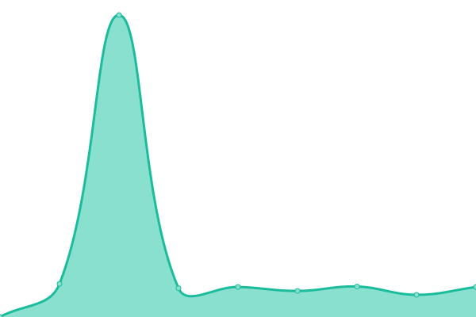

# [📈 Live Status](https://tfriz343.github.io/uptime): <!--live status--> **🟩 All systems operational**

This repository contains the open-source uptime monitor and status page for [tfriz343](https://tfriz343.github.io/uptime), powered by [Upptime](https://github.com/upptime/upptime).

With [Upptime](https://upptime.js.org), you can get your own unlimited and free uptime monitor and status page, powered entirely by a GitHub repository. We use [Issues](https://github.com/tfriz343/uptime/issues) as incident reports, [Actions](https://github.com/tfriz343/uptime/actions) as uptime monitors, and [Pages](https://tfriz343.github.io/uptime) for the status page.

<!--start: status pages-->
<!-- This summary is generated by Upptime (https://github.com/upptime/upptime) -->
<!-- Do not edit this manually, your changes will be overwritten -->
<!-- prettier-ignore -->
| URL | Status | History | Response Time | Uptime |
| --- | ------ | ------- | ------------- | ------ |
|  GitLab | 🟩 Up | [git-lab.yml](https://github.com/tfriz343/uptime/commits/HEAD/history/git-lab.yml) | 

 651ms
     
 | 

<a href="https://tfriz343.github.io/uptime/history/git-lab">99.18%</a>
    

|  Gallery | 🟩 Up | [gallery.yml](https://github.com/tfriz343/uptime/commits/HEAD/history/gallery.yml) | 

 770ms
     
 | 

<a href="https://tfriz343.github.io/uptime/history/gallery">99.19%</a>
    

|  The Library | 🟩 Up | [the-library.yml](https://github.com/tfriz343/uptime/commits/HEAD/history/the-library.yml) | 

 2720ms
     
 | 

<a href="https://tfriz343.github.io/uptime/history/the-library">12.90%</a>
    

<!--end: status pages-->

[**Visit our status website →**](https://tfriz343.github.io/uptime)

## 📄 License

- Powered by: [Upptime](https://github.com/upptime/upptime)
- Code: [MIT](./LICENSE) © [tfriz343](https://tfriz343.github.io/uptime)
- Data in the `./history` directory: [Open Database License](https://opendatacommons.org/licenses/odbl/1-0/)
